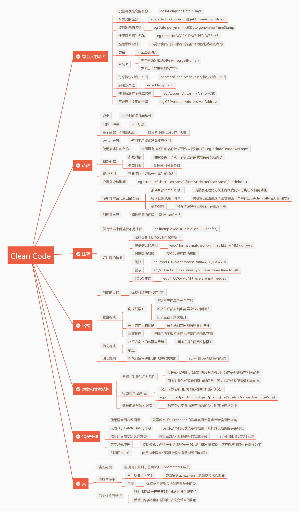

# 一、关于Bob大叔的Clean Code

　　《代码整洁之道》主要讲述了一系列行之有效的整洁代码操作实践。软件质量，不但依赖于架构及项目管理，而且与代码质量紧密相关。这一点，无论是敏捷开发流派还是传统开发流派，都不得不承认。这本书的阅读对象为一切有志于改善代码质量的程序员，书中介绍的规则均来自作者Bob大叔多年的实践经验，涵盖从命名到重构的多个编程方面，虽为一“家”之言，然诚有可资借鉴的价值。

　　最让我感受深刻的是封面图片和副标题，首先是封面图片：

　　

　　上面这张图是M104：草帽星系，其核心是一个质量超大的黑洞，有100万个太阳那么重，环绕着M104的光环就像一顶墨西哥草帽，仿佛经历了大爆炸之后碎片四溅的产物。联系到我们所经历过的没由整洁代码风格各异不可维护的软件项目，其实当你接手时之前的代码都是一个个的黑洞，存在着某天会定时爆发的风险，而当它真正爆发时，接手这个项目的所有人都会因此遭殃。

　　其次，再说说副标题：“**细节之中自有天地，整洁成就卓越代码**”。本书讲述的就是一个又一个的细节之处，不好的处理和好的处理都一一道来，让我们形成整洁的规范。

> Robert C. Martin，(Bob大叔)自1970年进入软件行业，从1990年起成为国际软件咨询师。是软件工程领域的大师级人物，是《敏捷软件开发：原则、模式与实践》、《敏捷软件开发：原则、模式与实践(C#版)》（邮电）、《极限编程实践》（邮电）等国内引进的畅销书的作者，其中第一本原著荣获美国《软件开发》第13届震撼（Jolt）大奖，Martin的敏捷系列书是软件工程界的权威书籍。

